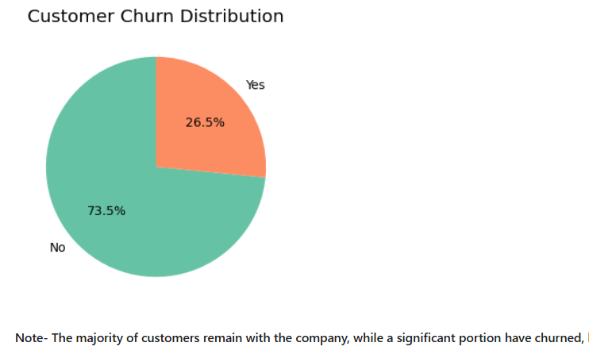
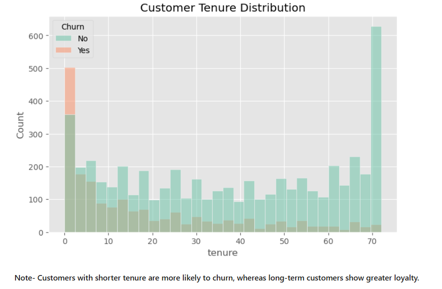
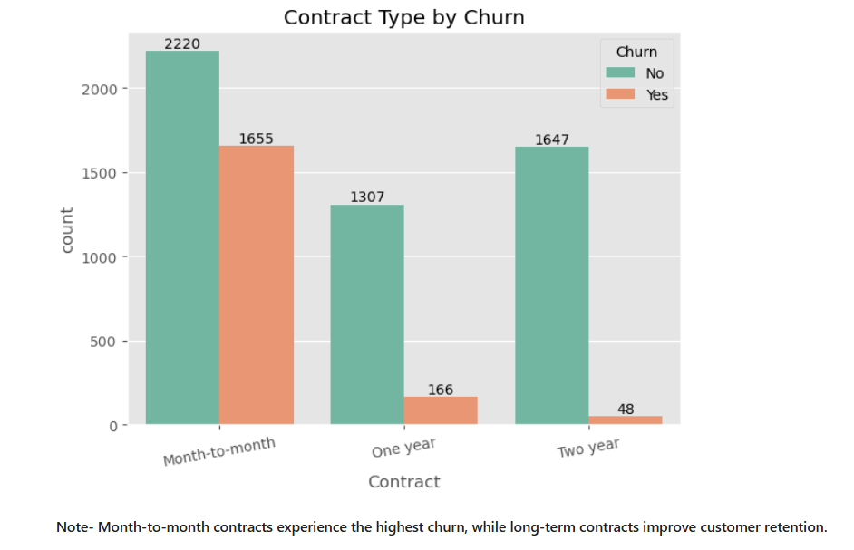
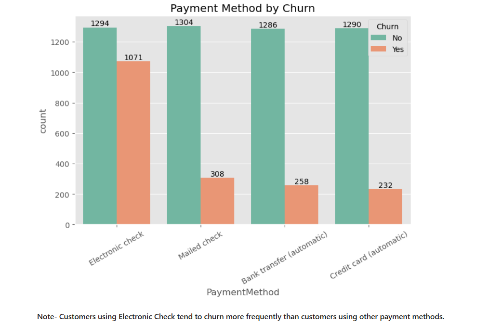

# Customer Churn Analysis | Python 

## Overview

Customer churn is one of the biggest challenges for subscription-based businesses. Retaining existing customers is often more cost-effective than acquiring new ones. This project performs an **Exploratory Data Analysis (EDA)** on a telecom customer dataset to identify the key factors influencing customer churn and provide actionable business recommendations.

The analysis was performed using Python by cleaning the dataset, exploring customer demographics, analyzing service usage patterns, and visualizing customer behavior through various charts.

---

# Business Problem

Telecom companies lose customers due to various reasons such as pricing, contract type, customer support, and service quality.

The objective of this project is to answer important business questions such as:

- Which customers are more likely to churn?
- Does contract type influence customer retention?
- How do monthly charges affect churn?
- Which payment methods are associated with higher churn?
- Which telecom services improve customer retention?
- What business actions can reduce customer churn?

---

# Dataset 

The dataset contains customer information collected from a telecom company.

It includes:

- Customer Demographics
- Contract Details
- Payment Information
- Internet Services
- Additional Telecom Services
- Monthly Charges
- Total Charges
- Customer Tenure
- Churn Status

---

## Jupyter Notebook

The complete Exploratory Data Analysis is available in the Jupyter Notebook.

**Notebook:** [Customer_Churn_Analysis.ipynb](01_Customer_Churn_Analysis.ipynb)

---

## Project Preview

### Customer Churn Distribution



---

### Customer Retention by Tenure



---

### Contract Type 



---

### Payment Method 



---

# Key Insights

- Customers with **month-to-month contracts** are more likely to leave the company than customers with long-term contracts.
- Customers with **shorter tenure** show a higher churn rate, indicating that new customers are at greater risk of leaving.
- Customers paying **higher monthly charges** tend to churn more often, suggesting that pricing may influence customer decisions.
- Customers using **Electronic Check** as their payment method have a higher churn rate compared to customers using other payment methods.
- Customers who subscribe to services such as **Online Security, Tech Support, and Online Backup** are generally less likely to churn, showing that these services help improve customer retention.

---

# Business Recommendations

- Encourage customers to switch to **long-term contracts** by offering discounts or exclusive benefits.
- Improve the onboarding experience and provide regular support for **new customers** during their first few months.
- Review pricing plans and introduce attractive offers for customers with **higher monthly charges**.
- Promote **Online Security, Tech Support, and Online Backup** through bundled packages to increase customer retention.
- Monitor customers with **higher churn risk** and engage them with personalized offers, loyalty rewards, and timely customer support before they decide to leave.

---

# 📁 Repository Structure

```
Customer-Churn-Analysis/
│
├── Dataset/
│   └── 00_Customer_Churn.csv
│
├── Notebook/
│   └── 01_Customer_Churn_Analysis.ipynb
|
├── README.md

```
# Tools & Technologies

- Python
- Jupyter Notebook
- Pandas
- NumPy
- Matplotlib
- Seaborn

# Conclusion

This project demonstrates how Exploratory Data Analysis can be used to understand customer behavior and identify the major factors contributing to customer churn. The insights generated from this analysis can help businesses improve customer retention strategies, reduce churn, and make more informed business decisions.

---

## About Me

**Mohd Affan**
